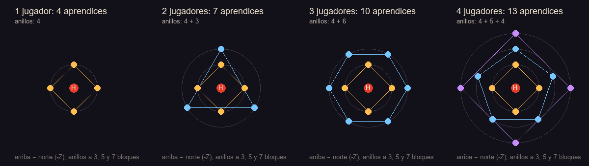

# El Cementerio entre Estrellas: la nueva pelea del Herrero Caído

Diseño completo del pedido de Andy del 2026-09-29. El Herrero Caído deja de despertarse en el sótano del Bastión:
ahora hay que abrir un portal y cruzar a una dimensión propia, que mezcla las dos ideas que eligió Andy: **El Taller
entre Estrellas** (una meseta de obsidiana en el vacío, bajo constelaciones que dibujan moldes de armas) y **El
Cementerio de Herreros** (una llanura de ceniza con miles de armas clavadas como tumbas, y forjas frías).

**Orden de trabajo (Andy, 2026-09-29): paso a paso.** Este documento recoge el diseño entero, pero en la primera
entrega solo se construye **la dimensión y su aspecto** (terreno, cielo y ambiente) y un comando para ir y volver.
El portal, la aleación, la perla, los cambios del jefe, los aprendices, las fases, la llegada, la persistencia y la
recompensa esperan a que Andy revise la dimensión. Cada sección dice en qué entrega va.

| Entrega | Qué lleva | Estado |
|---|---|---|
| 1 | Dimensión: terreno, arena, cielo, niebla, luz, partículas, sonido y música; `/forja dimension` | en esta rama |
| 2 | Oricalco, perla de oricalco, marco del portal, portal, retirada de la invocación vieja | pendiente de Andy |
| 3 | Pelea nueva: llegada, fases a 2/3 y 1/3, aprendices en formación, eventos, persistencia, estrella de vuelta y recompensa | pendiente de Andy |

---

## 1. Cómo se llega (entrega 2)

### 1.1 La aleación nueva: el **oricalco**

Un metal de leyenda hecho de **todos** los metales colables propios del mod. Se declara en `forge/Alloys.java`
como las demás aleaciones y se funde en el crisol, que pide a los depósitos de la red (`MeltNetwork`) lo que no cabe
en sus dos huecos, igual que ya hace con cualquier aleación de más de dos ingredientes.

| Dato | Valor |
|---|---|
| Calor | **Forja blanca** (crisol de obsidiana, o aliento de forja en los tubos) |
| Entra | 1 lingote de cada uno de los **17** metales propios de abajo |
| Sale | **4** lingotes de oricalco (5 con el crisol de obsidiana, que da +1 por aleación) |
| Tipo | Metal **solo de colada**, como el acero refractario: no es material de forja, no hace herramientas |

Los 17 metales (todos los `ForgeMaterial` propios que se pueden colar, más el hierro estelar, la placa hueca y la
escoria):

- **Metales base del mod (3):** hierro estelar, placa hueca, escoria.
- **Aleaciones templadas (4):** bronce, latón, peltre, electro.
- **Aleaciones calientes (3):** acero, cinerio, voltaico.
- **Aleaciones fundidas (5):** damasco, acero estelar, obsidiacero, almacero, vidriacero.
- **Aleaciones de forja blanca (2):** solacero, lunacero.

**Fuera, a propósito:**

- el **corazón de forja** y el **acero vivo**: solo salen del propio Herrero Caído, y pedirlos para llegar a él
  sería un círculo;
- el **acero refractario**: es el metal de los moldes, no un material;
- los metales vanilla (hierro, oro, cobre, netherita, diamante, obsidiana…): la aleación es "del mod".

Coste real de una tanda: unos 40 lingotes de metal base repartidos en las 17 aleaciones. Para las 4 perlas hacen
falta 8 lingotes de oricalco, es decir, **2 tandas** en el crisol de obsidiana (10 lingotes, sobran 2).

### 1.2 La **perla de oricalco** (colada sobre una perla de ender)

Se hace en la **mesa de colada**, a la manera del mod:

1. Se pone una **perla de ender** en la mesa como si fuera el molde (es el único objeto que la mesa acepta además de
   moldes y marcos; se añade a `CastingTableBlockEntity.pattern`).
2. La mesa tira de los depósitos como siempre y vierte **2 lingotes de oricalco** sobre ella.
3. Enfría (`COOK = 100` ticks) y sale una **perla de oricalco**. La perla de ender se gasta.

| Dato | Valor |
|---|---|
| Mesa mínima | **Mesa de almas** (el oricalco aguanta como la netherita: `holds` sin límite) |
| Coste | 2 lingotes de oricalco + 1 perla de ender |
| Colada basta o limpia | Da igual: una perla basta sirve igual (no tiene potencial) |
| Se apila | 16 |
| Rareza | Épica |

Textura: la perla de ender vanilla recoloreada al dorado verdoso del oricalco, con un brillo de estrella en el
centro (generador).

### 1.3 El **marco del portal** en el Bastión

El sitio de la fragua apagada, en la Forja Profunda del sótano (rotonda de radio 25, `tools/castillo_sotanos.py`,
`rotunda()`, bloque en el plano (100, −23, 92), pieza `bastion/p_2_0_3.nbt`), deja de invocar al jefe y pasa a ser
el portal:

- El estrado de 3 escalones se queda. Encima, un marco de 5 × 5: en el centro un hueco de 3 × 3 y alrededor 12
  bloques. **4 de ellos**, los del medio de cada lado (N, S, E y O), son **ménsulas estelares**
  (`forja:mensula_estelar`); las 8 esquinas y costados son ladrillo de piedra negra pulida.
- Cada ménsula tiene un hueco para una perla, como el ojo de ender en el portal del End (propiedad `perla`).
- Con clic derecho y una perla de oricalco en la mano, la perla se engasta (sonido de yunque y chispas).
- **Con 4 perlas** el hueco de 3 × 3 se llena de **portal estelar** (`forja:portal_estelar`). Con 3 o menos no pasa
  nada, y la ménsula dice cuántas faltan.
- **Se queda encendido para siempre.** Las perlas no se pueden sacar y las ménsulas son irrompibles
  (`strength -1`), como el marco del End.
- El portal estelar es como el del End: se ve el cielo de la dimensión dentro, y entrar en él te lleva a la
  **plataforma de llegada** de la dimensión (ver 2.4).

**Mundos existentes:** el bloque `forja:fragua_apagada` sigue registrado para que los mundos carguen. Ya no invoca
a nadie: si alguien le da clic derecho, se "abre": se convierte en el marco de 5 × 5 centrado en él, sin perlas, y
dice "La fragua se abre en un marco de estrellas". Los castillos nuevos ya salen con el marco. La fragua apagada de
la estructura vieja `fragua_caida` queda como decoración, con el mismo mensaje.

**Se quita:** la invocación en el mundo normal (`DeadForgeBlock.useWithoutItem` → `FallenSmith.summon`) y la
ofrenda (8 hierro estelar, 4 damasco, estrella del Nether, fragmento de eco). La prueba `oldSummonerNoLongerSummons`
lo comprueba. La rotonda se queda como sala del portal, sin bloqueo de construcción (el bloqueo va con el jefe).

---

## 2. La dimensión: **El Cementerio entre Estrellas** (entrega 1)

`forja:cementerio_estelar`. Una meseta sola en el vacío, bajo un cielo de estrellas eterno.

### 2.1 Tipo de dimensión

| Dato | Valor | Por qué |
|---|---|---|
| Alto | y 0 a 256 | como el End: espacio de sobra por debajo para ver el vacío |
| Hora | fija, noche eterna (sin línea de tiempo) | no hay día ni noche: el cielo es siempre de estrellas |
| Cielo | tipo "overworld", pero sin sol ni luna (el mixin del cielo los apaga) | las estrellas vanilla y las del mod |
| Luz del cielo | sí, fría: color `#8A95D6`, factor 0,45 | la llanura se ve azulada a la luz de las estrellas |
| Luz ambiente | 0,1 | lo que no toca el cielo sigue en penumbra |
| Camas y anclas | no sirven (no explotan: solo no dejan dormir) | no se puede fijar el punto de reaparición allí |
| Monstruos | no aparecen solos | la pelea es la que es |
| Lluvia | nunca | |

### 2.2 El generador: barato a propósito

Un generador propio (`world/StarYardGenerator`), **sin ruido**: cada columna se calcula con unas pocas sumas de
senos y un hash, sin muestrear nada. Todo lo que no es la meseta es aire, que es lo más barato que hay. No tiene
estructuras, así que `/locate` no tiene nada que buscar aquí y no puede congelar el juego; el teletransporte carga
chunks casi vacíos. Medido en la entrega 1 (ver 2.9).

### 2.3 La meseta

Coordenadas con el centro de la arena en (0, 0). La superficie base está en **y = 80**.

| Zona | Radio | Suelo | Qué hay |
|---|---|---|---|
| **Arena** (el Yunque) | 0 a 22 | obsidiana con dibujo | llana, sin nada que estorbe |
| Borde de la arena | 22 a 24 | ladrillo de piedra negra pulida y muro bajo | 4 entradas de 5 de ancho (N, S, E, O) |
| **Explanada** (el Taller) | 24 a 34 | obsidiana y piedra negra | 4 pilares con braseros de metal fundido; plataforma de llegada al norte |
| **Cementerio en filas** | 34 a 72 | ceniza | tumbas en anillos alrededor de la arena, cada 4 bloques |
| **Cementerio disperso** | 72 al borde | ceniza, ceniza prensada, basalto | armas sueltas, campos de fosas y forjas frías |
| **Borde** | 124 a 176 (ondulado) | cantil de obsidiana | se cae al vacío |

- **Forma del borde:** radio `150 + 14 sen(3θ + 1,1) + 8 sen(7θ + 2,3) + 4 sen(13θ + 0,4)`, entre 124 y 176
  bloques. No es un círculo: tiene cabos y ensenadas.
- **Relieve:** la arena y la explanada son planas. Desde el radio 34 la ceniza ondula ±3 bloques con suavidad, y
  llega entera al radio 54.
- **Por debajo:** la meseta es un cono invertido de 4 a 68 bloques de grueso (más gruesa en el centro), con capas de
  ceniza (2), obsidiana (2 o 3: la "losa del Taller", que se ve como una franja negra en los cantiles), piedra negra
  y basalto, y betas de obsidiana llorona.
- **Islotes:** 7 islotes de obsidiana flotan alrededor, entre 205 y 262 bloques del centro y a distintas alturas
  (y 55 a 118), de 7 a 18 de radio. Algunos llevan una tumba o una forja rota. Son lo que se ve a lo lejos.

### 2.4 La arena y la llegada

- **Suelo de la arena:** obsidiana, un disco de obsidiana llorona de radio 3 en el centro (donde caerá el
  Herrero), 8 radios de piedra negra pulida y dos anillos de piedra negra pulida cincelada y ladrillo, a 10 y a 20.
  Todo a y = 80, plano: nada en la arena tapa ni estorba.
- **Muro:** un muro de ladrillo de piedra negra pulida de 1 de alto, en el radio 23, con 4 entradas de 5 de ancho.
- **Pilares:** 4 pilares de 7 de alto en las diagonales (radio 28), con un brasero de metal fundido arriba (luz 15).
  Iluminan el borde de la arena con luz cálida, y el centro queda con la luz fría de las estrellas.
- **Plataforma de llegada:** un círculo de 5 de ladrillo de piedra negra pulida con un anillo de obsidiana llorona,
  en (0, 80, −30), al norte de la arena y mirando hacia ella. Ahí aparece quien cruza el portal (y quien usa
  `/forja dimension`).
- **Sin metal fundido cerca:** no hay metal fundido a menos de 24 bloques del borde de la arena.

### 2.5 El cementerio

- **Tumbas:** armas clavadas en el suelo (`forja:arma_clavada`), cada una un bloque sin colisión con el arma de
  punta, medio hundida. 6 armas: espada, espada negra, hacha, tridente, maza y pico, con las texturas vanilla
  recoloreadas a hierro oxidado y quemado. 4 orientaciones y 3 inclinaciones (0°, 22,5° hacia un lado y hacia el
  otro) por arma.
- **En filas (radio 34 a 72):** anillos cada 4 bloques y una tumba cada 3,2 bloques de anillo, mirando a la
  arena. Falta una de cada 7 (tumbas saqueadas). Unas 450.
- **Dispersas (radio 72 al borde):** un 5 % de las columnas, y un 16 % en los "campos de fosas" (celdas de 16 × 16
  que salen 1 de cada 5). Unas **3.500 tumbas** en total. Una de cada cinco tiene un montón de ceniza prensada
  debajo.
- **Forjas frías:** en celdas de 24 × 24, una de cada dos tiene una forja en ruinas, lejos de los ríos y de la
  arena (radio 76 al borde menos 14). Salen 37. Tres modelos:
  - **Fragua fría:** suelo de 7 × 7 de ladrillo agrietado, pared del fondo rota, un alto horno apagado con su
    chimenea, un yunque dañado y un caldero vacío.
  - **Yunques rotos:** tres yunques (mellado, dañado y entero) alrededor de una piedra de afilar, y dos armas
    clavadas.
  - **Horno hundido:** un ahumador apagado, una hoguera de almas apagada, un montón de bloques de carbón cubiertos
    de ceniza y restos de muro.

  Echan humo y alguna pavesa (partículas), nada más. Son decoración, sin cofres.

### 2.6 El metal fundido (solo decoración)

- **3 ríos** de metal fundido (`forja:metal_fundido`), a 30°, 150° y 270°. Nacen en un pilón a 52 bloques del
  centro (una piletita con un chorro que cae de un dintel de obsidiana) y serpentean hasta el borde.
- **Cauce:** 3 de ancho, con el metal un bloque por debajo del suelo. Las dos orillas llevan un **muro** de
  ladrillo de piedra negra pulida (1,5 de alto: no se salta), así que no se puede caer por accidente.
- **Puentes:** a 76 y 112 bloques del centro, de 5 de ancho, cerrados con muro por los lados.
- **Cascadas:** donde un río llega al borde, el metal cae por el cantil hacia el vacío y se pierde abajo, a
  y ≈ 4, soltando gotas.
- **Si alguien se mete:** quema como la lava (4 de daño por segundo y fuego) y frena, pero se puede salir andando.
  No se puede romper ni recoger.

### 2.7 El cielo

- **Vacío:** el cielo es casi negro (`#05050C`) por arriba.
- **El fondo del vacío arde** (Andy, 2026-09-29): por debajo del horizonte el cielo pasa del violeta oscuro a un
  **naranja de brasa** justo abajo, como si en el fondo del vacío hubiera lava o un horno. Es un degradado:
  - en el horizonte, violeta oscuro (`#1B1624`), sin brillo;
  - a −30°, granate (`#5A1A12`), a media fuerza;
  - mirando recto abajo, naranja de brasa (`#FF6A1E`), a toda fuerza, con un halo más claro en el centro que
    respira despacio (±12 % cada 7 s).
  - La **niebla** hace lo mismo: cuanto más miras hacia abajo, más se tiñe de brasa (hasta un 55 % mirando recto
    abajo), y también cuanto más bajo estás (a y = 20 ya es media brasa).
  - **Brasas que suben:** chispas que brillan solas suben despacio desde el fondo por debajo de la meseta, fuera de
    su sombra (unas 3 por tick alrededor del jugador, de 10 a 60 bloques por debajo de él).
- **Estrellas:** por debajo del horizonte se apagan en el resplandor: del todo a −35°.
- **Estrellas:** las 1.500 de vanilla a brillo pleno, y 900 más del mod, de colores (blancas, azules, doradas y
  alguna roja), que titilan despacio.
- **Una franja de nebulosa** (como una vía láctea) de violeta a ámbar, cruzando el cielo.
- **8 constelaciones que dibujan moldes de armas**, repartidas por el cielo: **Espada, Hacha, Martillo, Lanza,
  Escudo, Yunque, Tenazas y Guadaña**. Cada una es un contorno de 8 a 14 estrellas grandes unidas por líneas
  tenues, como el hueco de un molde visto desde arriba.
- **La colada del cielo:** cada 40 segundos una constelación "se cuela": un hilo de metal dorado recorre sus líneas
  de un extremo a otro en 6 s, se queda encendida 4 s y se enfría. En la pelea (entrega 3) es el aviso del evento
  *Molde celeste*.
- Todo gira muy despacio alrededor del eje norte-sur (una vuelta cada 40 minutos), para que el cielo esté vivo.
- **Día o noche:** no hay. Es siempre la misma noche; lo que cambia es la colada y el giro.

### 2.8 Ambiente

- **Niebla:** una bruma de ceniza violeta oscura (`#1B1624`) que empieza a 48 bloques y cierra a 256. La arena y la
  explanada se ven limpias; el borde y los islotes, velados. En altura (y > 110) la bruma se abre.
- **Luz:** fría de estrellas en todo; cálida (luz de bloque tintada de naranja) junto al metal fundido y los
  braseros.
- **Partículas:** ceniza del mod que cae y deriva por toda la llanura; chispas y gotas en el metal fundido y las
  cascadas; humo en las forjas frías.
- **Más ceniza cuanto más bajo** (Andy, 2026-09-29): la ceniza del ambiente es ligera a la altura de la arena
  (y = 80) y se espesa al bajar: el doble a y = 60, cinco veces a y = 40 y el máximo (8 veces) a y = 20 o menos,
  que es donde están los islotes bajos. Asomado al borde también se ve más ceniza por debajo de la meseta que por
  encima. Todo en el cliente (`StarYardSky`): no cuesta nada al servidor.
- **Sonido ambiente:** un bucle de viento hueco (el del valle de almas, más grave), y cada poco un sonido suelto:
  un martillo lejano, una campana que resuena, un tintineo de amatista (las estrellas) o escombros que caen.
- **Música:** "El Cementerio entre Estrellas", una lista de pistas vanilla bajadas de tono (el End, "So Below",
  "Echo in the Wind", "Deeper"), con pausas de 3 a 8 minutos. Todo por `sounds.json`, sin audio nuevo.

### 2.9 Para probar: `/forja dimension`

- `/forja dimension` te lleva a la plataforma de llegada, mirando a la arena. Guarda desde dónde viniste.
- `/forja dimension volver` te devuelve a donde estabas (o a tu punto de reaparición si no hay nada guardado).
- Permiso de administrador (nivel 2), como el resto de `/forja`.

---

## 3. La pelea (entrega 3)

### 3.1 Se mantienen

Golpe, onda, garfio, lluvia de estrellas (una estrella por llamada, con su aviso de 20 ticks), "La forja
reclama", el daño de un tercio de lo que no es un jugador (`jefeDanoAjeno` = 0,333) y el bloqueo de construir y
romper a menos de 32 bloques del jefe vivo. La vida sigue en 320.

### 3.2 La llegada: cae del cielo

Cuando un jugador entra en la dimensión y no hay pelea en curso:

1. A los **3 s**, una estrella se desprende del cielo encima de la arena (la constelación del Martillo se apaga).
2. **Cae durante 2 s** (40 ticks) desde y = 200 hasta el disco central, con estela de chispas, fuego y varillas
   del End, y el cielo se aclara un momento.
3. **Impacto:** onda de choque morada (la de `ShockwaveFx`), temblor de pantalla, sonido de yunque y explosión, sin
   daño. El Herrero se levanta del cráter (sin cráter de verdad: la arena no cambia).
4. **1 s después** aparece la barra y empieza la pelea. Mientras cae es invulnerable.

### 3.3 Fases: a 2/3 y a 1/3

| Fase | Vida | Qué cambia |
|---|---|---|
| 1 | 100 % a 66,7 % (320 a 213) | golpe, onda, "La forja reclama". **Sin aprendices.** |
| 2 | 66,7 % a 33,3 % (213 a 107) | primera oleada; se suma el garfio y el reforjado de ascuas |
| 3 | 33,3 % a 0 | segunda oleada; lluvia de estrellas, yunques del final |

Las fases viejas (75 %, 50 % y 25 %) desaparecen. Una fase solo se pasa una vez, aunque se cure (no se cura).

### 3.4 La animación de cambio de fase

Al cruzar 2/3 y 1/3:

1. El Herrero clava el martillo (la animación de llamar a los aprendices) y queda **invulnerable 3 s**.
2. Onda morada de fase (la de hoy).
3. **Los aprendices salen de la tierra, como zombis:** aparecen 2,2 bloques bajo el suelo en sus puestos y suben
   hasta la superficie en **40 ticks** (2 s), soltando partículas del bloque que atraviesan y con sonido de tierra
   removida (el de excavar del warden, más agudo). **Mientras suben no se les puede dañar** ni empujar, y no atacan.
4. Salen escalonados: el anillo de dentro primero y cada anillo 8 ticks después del anterior.

### 3.5 Los aprendices: cuántos y dónde

- **Ninguno al empezar.**
- **Cuántos por oleada:** `4 + 3 × (jugadores en la dimensión − 1)`. Se cuentan los jugadores vivos en la
  dimensión al empezar la oleada.
- **Dónde:** polígonos regulares concéntricos alrededor del jefe:
  - el anillo de dentro es un **cuadrado** (4), a 3 bloques;
  - cada anillo siguiente tiene **un vértice más** (pentágono, hexágono…), 2 bloques más afuera (5, 7, 9…);
  - se llenan de dentro afuera;
  - lo que sobra en el último anillo forma **su propio polígono regular, más pequeño**, en ese mismo radio.
- **Giro:** el primer vértice de cada anillo apunta al sur (+Z). Los anillos impares se giran medio lado para que
  no queden alineados con los de dentro.

| Jugadores | Aprendices | Anillos | Posiciones (x, z) respecto al jefe |
|---|---|---|---|
| 1 | 4 | cuadrado | (0, 3), (3, 0), (0, −3), (−3, 0) |
| 2 | 7 | cuadrado + **triángulo** | lo anterior + (4,3, 2,5), (0, −5), (−4,3, 2,5) |
| 3 | 10 | cuadrado + pentágono + **1** | cuadrado + (2,9, 4), (4,8, −1,5), (0, −5), (−4,8, −1,5), (−2,9, 4) + (0, 7) |
| 4 | 13 | cuadrado + pentágono + **cuadrado** | lo de 3 sin el (0, 7) + (0, 7), (7, 0), (0, −7), (−7, 0) |

Con 3 jugadores el resto es 1, y "un polígono de un vértice" es un aprendiz solo, al sur a 7 bloques. Ver las
decisiones para Andy.

Si un puesto cae en un bloque sólido o fuera de la arena, el aprendiz sale en el punto libre más cercano del
mismo anillo.

### 3.6 Eventos de la dimensión durante la pelea

Cada **35 a 45 s** la dimensión hace algo, por turnos, y nunca durante una llegada ni un cambio de fase:

1. **Lluvia de hierro estelar** (la de Andy): cae **un meteorito por jugador** con el aviso de siempre (anillo en el
   suelo 34 ticks). Hace el daño de siempre, pero **sin cráter** (la arena no cambia) y deja 3 a 6 de hierro
   estelar. El **pararrayos** funciona igual que en el mundo normal: uno a 12 bloques o menos se lo lleva (y se
   gasta), así que se puede llevar a la pelea y ponerlo **antes** de que empiece (el bloqueo de construcción
   empieza con el jefe).
2. **Molde celeste:** una constelación se cuela en el cielo (el hilo dorado, 3 s de aviso) y su molde se
   **proyecta en el suelo de la arena**: el contorno del arma (de 10 a 14 bloques de largo) se dibuja con
   partículas doradas sobre la obsidiana. A los **3 s** el contorno arde **2 s**: 6 de daño y fuego a quien pise la
   línea (jugadores y aprendices, no al jefe). Obliga a moverse y a leer el cielo.
3. **Tormenta de ceniza:** la bruma se cierra a **20 bloques** durante **12 s** y el viento empuja a todos
   (0,06 bloques por tick hacia un lado fijo, que se avisa con la ceniza). El jefe también ve menos: su alcance de
   persecución baja de 48 a 16. Sirve para despistarle o para perderle de vista.

Con los números en `config/forja.json` (`dimensionEventoCada`, `dimensionMoldeDano`, `dimensionCenizaSegundos`…).

### 3.7 Morir y volver

- Un jugador que muere **reaparece en su punto normal** (su cama o el punto de aparición del mundo), porque en la
  dimensión no se puede fijar otro.
- Puede volver a entrar: el portal sigue encendido.
- **La pelea se queda exactamente como estaba:** la vida del jefe, su fase, las oleadas que ya salieron y los
  aprendices vivos. **No se cura.**
- **Se para mientras no haya ningún jugador en la dimensión:** no se mueve, no ataca, no cuenta esperas ni
  eventos. En cuanto entra alguien, sigue (sin volver a caer del cielo).
- Lo guarda un `SavedData` de la dimensión: estado (esperando, en pelea, derrotado), el UUID del jefe, la fase, las
  oleadas hechas, los participantes (todo jugador que haya estado en la dimensión con la pelea en curso) y, por si
  el jefe se perdiera, su vida. Sobrevive a guardar y cargar el mundo.
- Si alguien sale por la estrella de vuelta o se desconecta, cuenta igual que morir.

### 3.8 Cuando muere: la estrella de vuelta

- Al morir, **una estrella cae del cielo** (la misma caída de la llegada, pero blanca y dorada) en el centro de la
  arena, 3 s después.
- Donde cae queda la **Estrella de vuelta** (`forja:estrella_de_vuelta`): un bloque que brilla, con un haz como un
  faro. Con clic derecho te lleva de vuelta **al portal por el que entraste** (se guarda por jugador; si no hay,
  a tu punto de reaparición).
- Se queda en la arena hasta que llegue la próxima pelea. Los aprendices que queden se deshacen en ceniza.

### 3.9 Revancha

Tras una victoria, la dimensión queda en calma **un día de juego** (20 minutos). Pasado ese tiempo, el siguiente
jugador que entre hace caer al Herrero de nuevo. Ver decisiones.

---

## 4. La recompensa: la **Estrella forjada** (entrega 3)

Lo que da hoy (corazón de forja, una leyenda, el yunque del Herrero y el martillo del maestro) se queda. Además, a
**cada jugador que participó** (ver 3.7) le cae **una Estrella forjada** (`forja:estrella_forjada`), a sus pies o
en el inventario si está en la dimensión, y guardada para cuando entre si no estaba.

### 4.1 Qué hace

Se usa en la **forja mayor** sobre **una pieza terminada** (arma, herramienta, armadura o arma mágica). Una por
pieza, para siempre (componente `ESTRELLADA`):

| Qué | Antes (lo mejor de hoy) | Con la Estrella |
|---|---|---|
| Tope de potencial | 100 | **125** |
| Potencial de la pieza | el que tenga | **+25** (sin pasar de 125) |
| Carga (puntos de mejora) | 20 a potencial 100 | **26** a potencial 125 (+30 %) |
| Bono de daño del material (armas y herramientas) | corazón 4,5 | ×1,12: **5,04** |
| Durabilidad | corazón 2.400 | ×1,5: **3.600** |
| Velocidad de minado (herramientas) | la del material | ×1,12 |
| Armadura | la del material | **igual** (solo carga y durabilidad) |
| Aspecto | | un brillo de estrellas en la pieza y el nombre en dorado |

- **Por qué la armadura no sube:** `ArmaduraGameTests` exige que ningún juego pase de netherita P4 + 5 puntos, y el
  obsidiacero ya llega a +5,9 en el peor caso. La Estrella le da a la armadura más carga (más mejoras) y más
  durabilidad, no más defensa directa.
- **Cuánto es:** una espada de corazón perfecta pasa de 4,5 a 5,04 de bono y de 20 a 26 puntos de mejora. Con esos
  6 puntos caben una o dos mejoras más (una de peso 4 y una de 2, o tres de 2). Es un salto claro sobre lo mejor que
  hay, pero no multiplica: el mismo arma, un 20 a 30 % más fuerte en total.
- **No se apila:** una sola Estrella por pieza, y no sirve sobre piezas que no sean forjadas del mod.

### 4.2 Textura

Una estrella de cinco puntas de oro y oricalco, hecha con el generador a partir de la estrella del Nether vanilla
recoloreada.

---

## 5. Pruebas previstas

### Entrega 1 (esta rama)

- **Servidor (`DimensionGameTests`):** el servidor de pruebas no carga las dimensiones de los datapacks, así que
  aquí se comprueba el generador directamente (es una función pura de la columna):
  - el tipo de dimensión, el bioma y el generador están registrados, y existe `/forja dimension volver`;
  - la arena es plana y sin obstáculos, y la plataforma de llegada es firme;
  - no hay metal fundido a menos de 24 bloques de la arena (salvo los braseros, a 7 de alto);
  - hay entre 2.500 y 6.000 tumbas (salen 4.021), entre 20 y 60 forjas frías (37) y cascadas por el borde;
  - las columnas de 400 chunks se calculan en menos de 3 s (0,07 s medidos).
- **Cliente (`FORJA_SOLO=dimension`):** entra con `/forja dimension` como jugador, comprueba que está en la
  plataforma de llegada, saca 22 capturas y vuelve con `/forja dimension volver`: llegada, arena, arena desde
  arriba, tumbas, la colada de una constelación, las constelaciones, un río con su puente, un manantial, una
  cascada, una forja fría, **el vacío mirado desde el borde y recto abajo**, la meseta desde abajo, la vista de
  lejos desde dos islotes y desde lo alto, y cuatro vistas sin niebla. Hoja de contactos en
  `E:\IA\Claude\Forja_capturas_mejoras\dimension_herrero\hoja_de_contactos.jpg`.

### Entregas 2 y 3

- **Servidor:**
  - el oricalco y la perla se cuelan;
  - 4 perlas encienden el marco y 3 no;
  - el portal lleva a la dimensión;
  - cuántos aprendices y en qué puestos, de 1 a 4 jugadores;
  - fases solo a 2/3 y a 1/3;
  - la pelea se conserva tras morir y tras guardar y cargar;
  - la estrella de vuelta cae al morir el jefe;
  - la recompensa cae una vez por participante;
  - la fragua vieja ya no invoca.
- **Cliente:** encender el portal con clics de verdad, cruzar, ver caer la estrella, un cambio de fase con los
  aprendices saliendo de la tierra, matarlo (con comandos para acelerar) y volver.

---

## 6. Decisiones para Andy

1. **Nombre:** "El Cementerio entre Estrellas" para la dimensión, "oricalco" para la aleación, "perla de
   oricalco", "Estrella forjada" para la recompensa. ¿Te valen?
2. **Oricalco sin el corazón de forja ni el acero vivo:** los dos solo salen del jefe. ¿De acuerdo?
3. **Con 3 jugadores sobra 1 aprendiz:** sale solo, al sur a 7 bloques. ¿O prefieres que el sobrante se reparta
   en el anillo anterior (4 + 6)?
4. **Revancha:** ¿el jefe vuelve tras un día de juego y da otra Estrella a cada uno? (Con una por pieza, farmearlo
   solo sirve para mejorar más piezas.)
5. **La Estrella no sube la armadura directa**, solo la carga y la durabilidad. ¿O prefieres saltarte el tope de
   netherita P4 + 5 para las piezas estrelladas?
6. **Eventos:** meteoritos, molde celeste y tormenta de ceniza, cada 35 a 45 s. ¿Te gustan, o cambio alguno?
